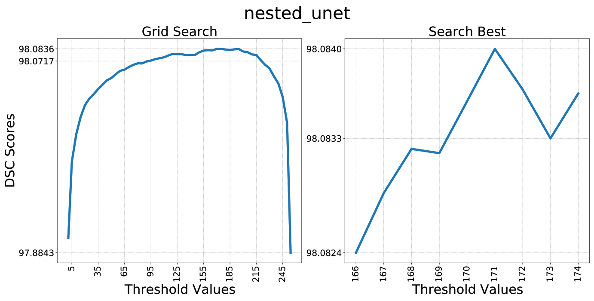
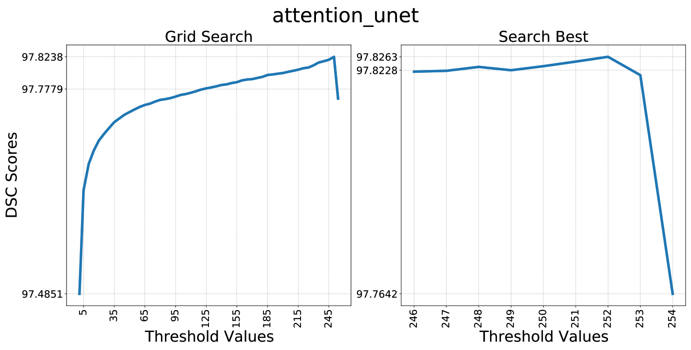
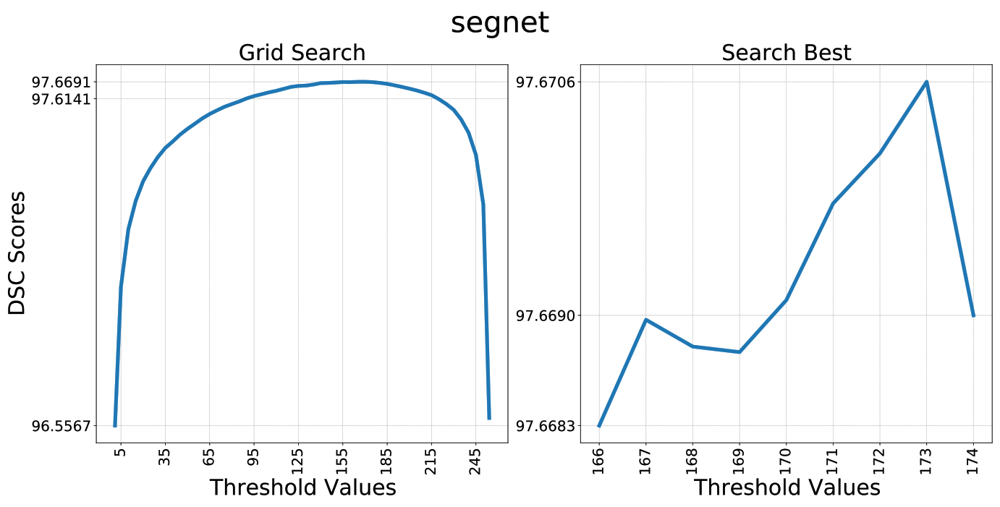
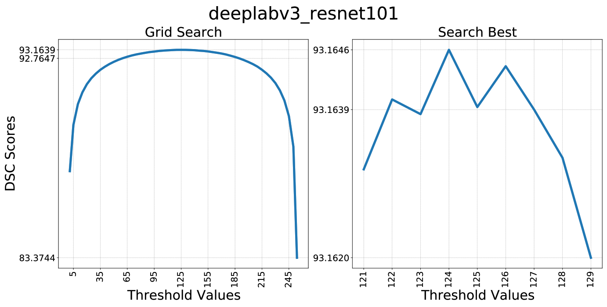
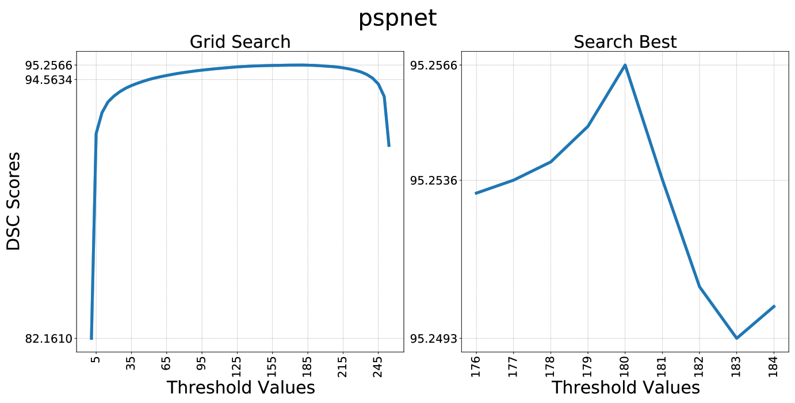

# Chromosome Segmentation

# Setup Environment

## Cuda and cuDNN Version

Cuda 10.2

Cudnn v8.1.0.77

## Create Conda Environment using environment.yml
```bash
conda env create -f environment.yml
```
or
```bash
conda env create -n <env-name> -f environment.yml
```

## Create Conda Environment and Install Libraries 
```bash
conda create -n <your_env_name> python=3.7
```

```bash
activate <your_env_name>
```

```bash
conda install pytorch==1.8.0 torchvision==0.9.0 torchaudio==0.8.0 cudatoolkit=10.2 -c pytorch
```

```bash
conda install -c anaconda pillow scikit-image scikit-learn imageio pandas seaborn
```

```bash
conda install -c conda-forge pytorch-model-summary tensorflow==1.15
```

```bash
pip install ptflops
```

## Cloud TPU Usage
To use cloud TPU run the code below to install torch_xla before running the tpu_train.py and tpu_inference.py files
```bash
!pip install cloud-tpu-client==0.10 https://storage.googleapis.com/tpu-pytorch/wheels/torch_xla-1.8-cp37-cp37m-linux_x86_64.whl
```

# Results


## Overall Evaluation Metrics
|          Model          |  Params |     MACs    | Dice (%) |  Se (%) |  Sp (%) | Pre (%) | Acc (%) |
|:-----------------------:|:-------:|:-----------:|:--------:|:-------:|:-------:|:-------:|:-------:|
|          U-Net          |  7.76 M |  64.24 GMac |  99.4998 | 99.5379 | 99.7306 | 99.4616 | 99.6664 |
|      Residual U-Net     |  8.11 M |  67.39 GMac |  99.7657 | 99.7649 | 99.8833 | 99.7666 | 99.8438 |
|         U-net++         |  9.05 M | 158.91 GMac |  98.9878 | 98.1763 | 99.9079 | 99.8128 | 99.3307 |
|     Attention U-net     | 34.88 M | 312.04 GMac |  99.6272 | 99.6367 | 99.8088 | 99.6177 | 99.7515 |
|          CE-Net         |  29.0 M |  41.89 GMac |  99.7414 | 99.7416 | 99.8706 | 99.7412 | 99.8276 |
|          SegNet         | 29.44 M | 188.33 GMac |  99.7415 | 99.7511 | 99.8659 | 99.7319 | 99.8277 |
|    FCN8s (Resnet-101)   | 51.94 M | 253.85 GMac |  99.3271 | 99.3324 | 99.6609 | 99.3218 | 99.5514 |
| DeepLab v3 (Resnet-101) | 58.63 M | 283.44 GMac |  99.2612 | 99.2848 | 99.6186 | 99.2377 | 99.5074 |
|   PSPNet (Resnet-101)   | 72.31 M | 327.25 GMac |  99.3541 | 99.3847 | 99.6615 | 99.3234 | 99.5693 |
|       Proposed CNN      |  8.11 M |  67.44 GMac |  99.7836 |  99.787 | 99.8901 | 99.7802 | 99.8557 |

## Threshold DSC Scores (Grid Search, Search Best)











## Final Evaluation Metrics
|            Model            | Dice (%) |  Se (%) |  Sp (%) | Pre (%) | Acc (%) |
|:---------------------------:|:--------:|:-------:|:-------:|:-------:|:-------:|
| Local Adaptive Thresholding |  76.1106 | 71.8094 | 99.3036 | 84.3697 | 97.5273 |
|      Histogram Analysis     |  81.3935 | 79.8560 | 99.3562 | 85.4999 | 98.1877 |
|         U-Net (t=18)        |  98.1012 | 98.1355 | 99.9144 |  98.072 | 99.8397 |
|    Residual U-Net (t=187)   |  97.9031 | 97.8826 |  99.908 | 97.9306 | 99.8227 |
|       U-Net++ (t=171)       |  98.084  | 98.1604 | 99.9115 | 98.0139 | 99.8378 |
|   Attention U-Net (t=252)   |  97.8263 | 97.6727 | 99.9116 | 97.9905 | 99.8163 |
|        CE-Net (t=190)       |  97.677  | 97.6342 |  99.899 | 97.7274 | 99.8039 |
|        SegNet (t=173)       |  97.6706 | 97.6965 | 99.8959 | 97.6528 | 99.8033 |
|        FCN8s (t=109)        |  93.3623 | 92.2031 | 99.7601 | 94.5663 | 99.4357 |
|      DeepLab v3 (t=124)     |  93.1646 | 91.8936 |  99.757 | 94.4835 | 99.4186 |
|        PSPNet (t=180)       |  95.2566 | 95.1396 | 99.7966 |  95.386 | 99.6006 |
|     Proposed CNN (t=131)    |  98.0006 | 97.9824 | 99.9121 | 98.0316 |  99.832 |
|      Proposed CNN + BCN     |  98.735  | 98.6783 | 99.9467 | 98.7918 | 99.8931 |

## Comparisons
|  |  |  |  |